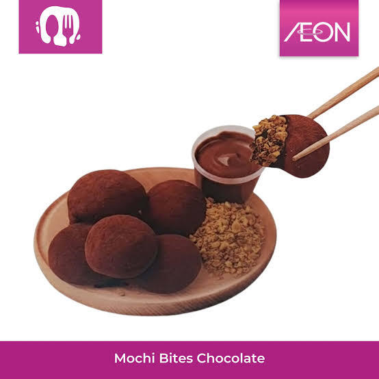
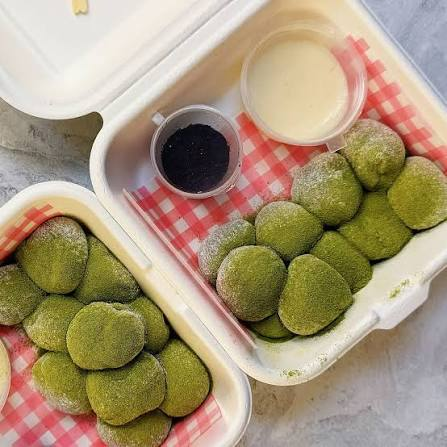
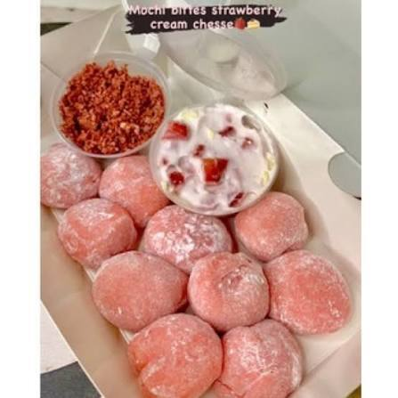

<!DOCTYPE html>
<html lang="id">
<head>
    <meta charset="UTF-8">
    <meta name="viewport" content="width=device-width, initial-scale=1.0">
    <title>Mochi Bites Premium</title>
    
</head>
<body>

<header>
    
🍡 Mochi Bites

    

        <button onclick="changeLang('id')" id="btn-id" class="active">ID</button>
        <button onclick="changeLang('th')" id="btn-th">TH</button>
        <button onclick="changeLang('ko')" id="btn-ko">KO</button>
    

</header>

<section class="hero">
    <h1 id="hero-title">Mochi Bites Lembut & Lumer</h1>
    
Dibuat dengan cinta dan bahan premium terbaik.

</section>

    

        
        <h3 id="p1-title">Cokelat Belgia</h3>
        
Isian cokelat lumer yang melimpah.

        <a href="https://wa.me/6285778508125?text=Halo,%20saya%20mau%20pesan%20Mochi%20Cokelat" class="btn-order" id="p1-btn">Pesan via WA</a>
    

    

        
        <h3 id="p2-title">Matcha Kyoto</h3>
        
Rasa teh hijau autentik yang menenangkan.

        <a href="https://wa.me/6285778508125?text=Halo,%20saya%20mau%20pesan%20Mochi%20Matcha" class="btn-order" id="p2-btn">Pesan via WA</a>
    

    

        
        <h3 id="p3-title">Strawberry Cheese</h3>
        
Perpaduan asam segar dan keju gurih.

        <a href="https://wa.me/6285778508125?text=Halo,%20saya%20mau%20pesan%20Mochi%20Strawberry" class="btn-order" id="p3-btn">Pesan via WA</a>
    

<footer>
    &copy; 2024 Mochi Bites Premium - Freshly Made Everyday
</footer>

</body>
</html>
